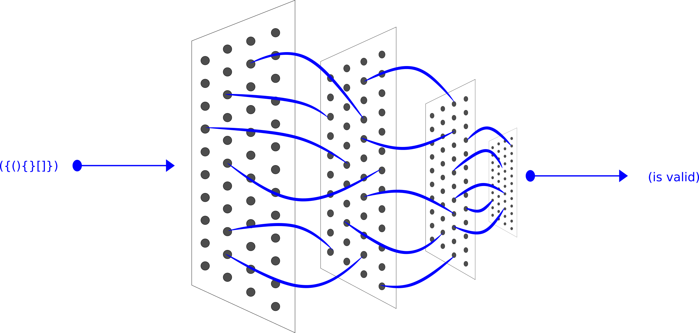

# Desafio de Lógica
1. [Descrição](#descrição)
2. [Restrições](#restrições)
3. [Exemplo](#exemplo)
4. [Explicação](#explicação)
5. [Solução](#solução)

## Descrição
Considerando que um *bracket* seja qualquer um dos seguintes caractéres: `(`,  `)`, `{`, `}`, `[`, ou `]`.

Dois *brackets* estão combinados se um par de *brackets* abertos (`(`, `[`, ou `{`) aparece à esquerda de um *bracket* fechado (`)`, `]`, ou `}`) do mesmo tipo. Existem três tipos de *brackets* combinados: `[]`, `{}`, e `()`.

Um par de *brackets* não está balanceado se o grupo de *brackets* que ele contém não estiver combinado. Por exemplo, `{[(])}` não está balanceado porque o conteúdo entre `{` e `}` não está balanceado. O par de colchetes contém um único e não balanceado parêntesis, `(`, e o par de parêntesis contém um único e não balanceado colchete, `]`.

Resumindamente, podemos dizer que um grupo de *brackets* é considerado balanceado se as seguintes condições forem cumpridas:

- Não contém nenhum *bracket* não combinado.
- O sub-grupo de *brackets* dentro de um par combinado de *brackets* é, também, um par de *brackets* combinados.

Dadas *strings* de *brackets*, determine se a sequência de *brackets* está balanceada. 
Se uma *string* está balanceada, imprima `SIM`, se não, imprima `NÃO`.

## Restrições
- Cada caractére na sequência será um *bracket* (`{`, `}`, `(`, `)`, `[`, e `]`).

## Exemplo
### Entrada
```
{[()]}
{[(])}
{{[[(())]]}}
```
### Saída
```
SIM
NÃO
SIM
```

## Explicação
1. A *string* `{[()]}` cumpre ambos os critérios para ser uma *string* balanceada. Por isso, imprimimos `SIM`.
2. A *string* `{[(])}` não é balanceada porque os *brackets* pelos pares combinados `[(]` e `(])` não estão balanceados. Por isso, imprimimos `NÃO`.
3. A *string* `{{[[(())]]}}` cumpre ambos os critérios para ser uma *string* balanceada. Por isso, imprimimos `SIM`.

## Solução
Desafio dos brackets resolvido com `LSTM` (Long Short Term Memory) - redes de memória de longo prazo.



```shell
TRAIN:
iterations: 0, training error: 0.17674836072952757
iterations: 50, training error: 0.014692423938022045
iterations: 100, training error: 0.013980512444342829
iterations: 150, training error: 0.013706176746365277
iterations: 200, training error: 0.013508083177534536
iterations: 250, training error: 0.0136686798943847
iterations: 300, training error: 0.013467078872401107
iterations: 350, training error: 0.01354790909091783
iterations: 400, training error: 0.013573626042059153
iterations: 450, training error: 0.013472026200373795
iterations: 500, training error: 0.013435319648671323
iterations: 550, training error: 0.014788439164104373
iterations: 600, training error: 0.01373731675279416
iterations: 650, training error: 0.013668934699798447
iterations: 700, training error: 0.01351239715528565
iterations: 750, training error: 0.01360155560237682
iterations: 800, training error: 0.013560514692187123
iterations: 850, training error: 0.013485043499423055
iterations: 900, training error: 0.013451153684887533
iterations: 950, training error: 0.014452897637636632
iterations: 1000, training error: 0.013759066198086334
iterations: 1050, training error: 0.013536529698496915
iterations: 1100, training error: 0.013494664288348987
iterations: 1150, training error: 0.013533942495869606
iterations: 1200, training error: 0.013420887182052161
iterations: 1250, training error: 0.018515265200596865
iterations: 1300, training error: 0.013895659375511463
iterations: 1350, training error: 0.0136097084661886
iterations: 1400, training error: 0.01356031349787196
iterations: 1450, training error: 0.013509563959079611

OUTPUT:
"()             ": valid
"{[()]}         ": valid
"[(){}]         ": valid
"()]            ": invalid
"[]]]           ": invalid
"(([]}}         ": invalid
```